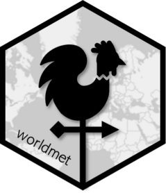
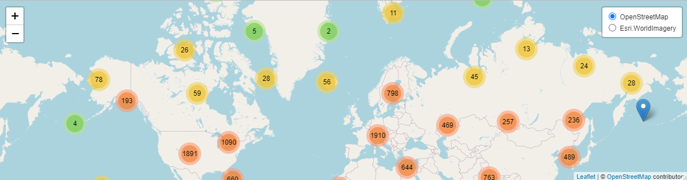

<div align="center">



## **worldmet**
### open source tools to access NOAA meteorological observations

<!-- badges: start -->
[](https://github.com/openair-project/worldmet/actions)
[](https://CRAN.R-project.org/package=worldmet)
[](https://cran.r-project.org/package=worldmet)
<br>
[](https://github.com/openair-project/worldmet)
[](https://openair-project.github.io/worldmet/)
[](https://openair-project.github.io/book/)
<!-- badges: end -->

</div>

**worldmet** provides an easy way to access data from the [NOAA Global Historical Climate Network](https://www.ncei.noaa.gov/products/global-historical-climatology-network-hourly) and the [NOAA Integrated Surface Database](https://www.ncei.noaa.gov/products/land-based-station/integrated-surface-database) (ISD). The GHCN contains detailed surface meteorological data from around the world for over 35,000 locations. The data available through the package work very well with the [**openair**](https://github.com/openair-project/openair) package.

<div align="center">

*Part of the openair toolkit*

[](https://openair-project.github.io/openair/) | 
[](https://openair-project.github.io/worldmet/) | 
[](https://openair-project.github.io/openairmaps/) | 
[](https://openair-project.github.io/deweather/)

</div>

<hr>

## 💡 Core Features

**worldmet** has a small handful of core functionality.

- **Access metadata** using `import_ghcn_stations()`.

- **Import monitoring data** using `import_ghcn_hourly()`. Data is in a format ready to use with, for example, `openair::windRose()`.

- **Write files in ADMS format** using `write_adms()`.

<div align="center">

</div>

<hr>

## 📖 Documentation

All **worldmet** functions are fully documented; access documentation using R in your IDE of choice.

```r
?worldmet::import_ghcn_stations
```

Documentation is also hosted online on the **package website**.

[](https://openair-project.github.io/worldmet/)

A guide to the openair toolkit can be found in the **online book**, which contains lots of code snippets, demonstrations of functionality, and ideas for the application of **openair**'s various functions.

[](https://openair-project.github.io/book/)

<hr>

## 🗃️ Installation

**worldmet** can be installed from **CRAN** with:

``` r
install.packages("worldmet")
```

You can also install the development version of **worldmet** from GitHub using `{pak}`:

``` r
# install.packages("pak")
pak::pak("openair-project/worldmet")
```

<hr>

🏛️ **worldmet** is primarily maintained by [David Carslaw](https://github.com/davidcarslaw).

📃 **worldmet** is licensed under the [MIT License](https://openair-project.github.io/worldmet/LICENSE.html).

🧑‍💻 Contributions are welcome from the wider community. See the [contributing guide](https://openair-project.github.io/worldmet/CONTRIBUTING.html) and [code of conduct](https://openair-project.github.io/worldmet/CODE_OF_CONDUCT.html) for more information.
